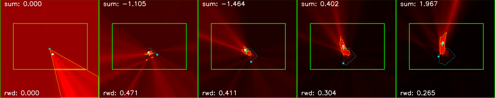
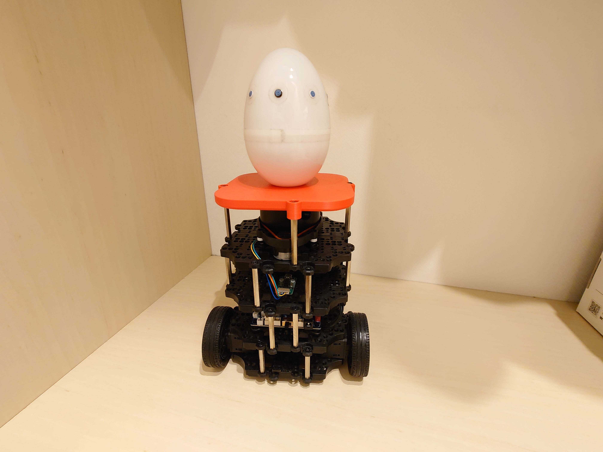

# Sound WM Turtlebot: 世界モデルベース強化学習を利用した，単一移動ロボットによる音源定位


## 概要
このプロジェクトは、ROS2を利用したTurtlebot3による音源定位システムの実装を目指しています。
SLAMに基づくナビゲーションと深層強化学習アルゴリズムを組み合わせ、ロボットが環境内で音源を自律的に特定し、追跡できるようにします。
現時点では強化学習（DreamerV3、DrQ-v2）によるシミュレーション上でのポリシー学習に対応しています．

## インストール
### システム要件
- Ubuntu 22.04
- ROS2 Humble
- Python 3.8以上
- CUDA対応のNVIDIA GPU

### [ROS2のインストール](documents/ros2_setup.md)

### [NVIDIAドライバーとCUDAのセットアップ](documents/cuda_setup.md)

### プロジェクトのセットアップ
```bash
# ワークスペースの作成
mkdir -p ~/ros2_ws/src
cd ~/ros2_ws/src
git clone https://github.com/Azuma413/sound_turtlebot.git

# Python依存パッケージのインストール
cd sound_turtlebot
pip install -r requirements.txt
pip install torch torchvision torchaudio --index-url https://download.pytorch.org/whl/cu124

# ワークスペースのビルド
cd ~/ros2_ws
colcon build
```

## 使用方法

### [実環境動作(実装中)](documents/ros_use.md)

### 学習
- 学習用設定の変更\
`sound_turtle/sound_turtle/my_config/`に設定ファイルが格納されています．
- 学習用環境の変更\
`sound_turtle/sound_turtle/my_envs/my_env.py`に学習用のシミュレータが実装されています．
- 学習の実行
```bash
# DreamerV3の学習  
python sound_turtle/sound_turtle/train_dreamer.py  

# DrQv2の学習  
python sound_turtle/sound_turtle/train_drq.py  
```

## ディレクトリ構成
```
.  
├── sound_turtle/                    # メインのROS2パッケージ  
│   ├── launch/                     # Launchファイル  
│   ├── sound_turtle/               # Pythonパッケージ  
│   │   ├── my_envs/               # 環境実装  
│   │   ├── my_config/             # 設定ファイル  
│   │   ├── dreamerv3/             # DreamerV3実装  
│   │   └── drqv2/                 # DrQv2実装  
│   └── test/                       # テストファイル  
├── sound_turtle_msgs/              # カスタムROS2メッセージ  
├── work_space/                      # 開発用ワークスペース  
├── image_data/                      # 画像データ  
└── cad_data/                        # CADモデル  
```

## 重要なディレクトリ
- 学習時に利用するSLAMマップ: `sound_turtle/sound_turtle/my_envs/map/`
- 学習済み重み: `sound_turtle/sound_turtle/weight/`
- 学習用のconfig: `sound_turtle/sound_turtle/my_config/`

## CADデータ
TurtleBot3 Burger用のマイクロフォンアレイ固定パーツを配布します．\
`.stl`と`.stp`がありますが，どちらも同じ内容です．\
マイクロフォンアレイを固定する金具は[こちら](https://www.amazon.co.jp/dp/B07QKTVSPQ?ref=ppx_yo2ov_dt_b_fed_asin_title)を利用しています．


## ライセンスと引用

### ライセンス
このプロジェクトはリポジトリ内の[LICENSE](LICENSE)ファイルの下でライセンスされています。

### 引用
本プロジェクトを研究に使用する場合は、以下を引用してください：
```
[引用情報を追加予定]
```